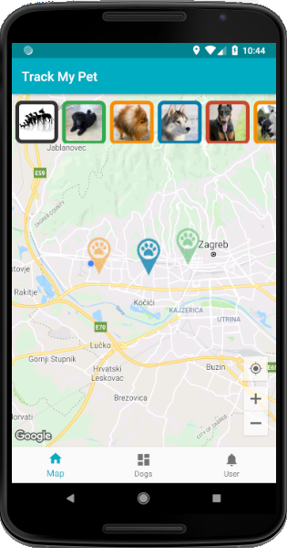
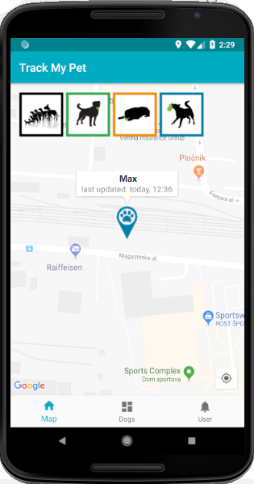
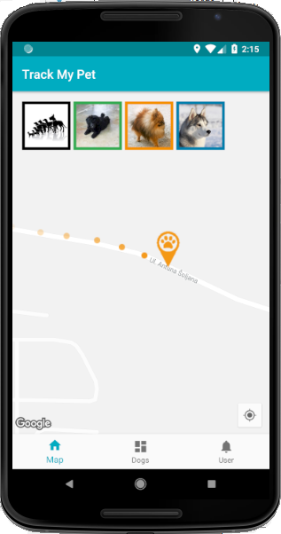
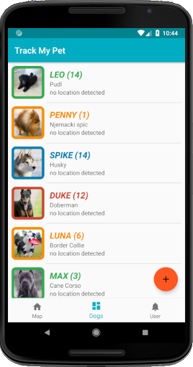
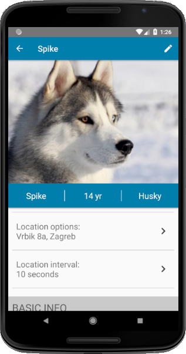
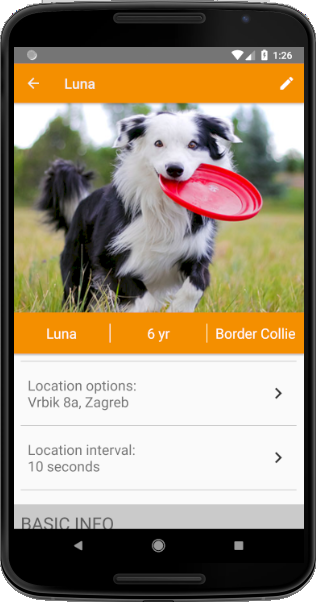
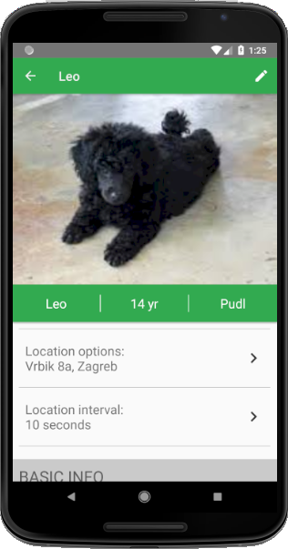
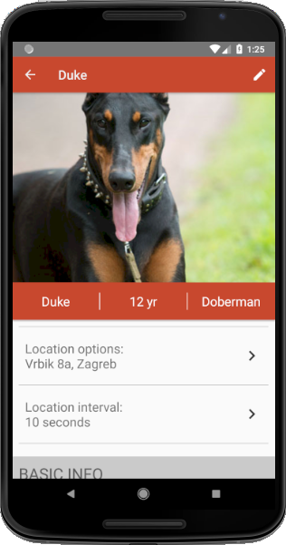

# dogTracker

1. Map = shows user and dogs positions
* marker opacity depends on the time passed from the last location update
* clicking on dog image, starts dog tracking (image 2)
* clicking on dog marker shows bubble with info about location update

   

2. List of all dogs, and their detail pages

    
