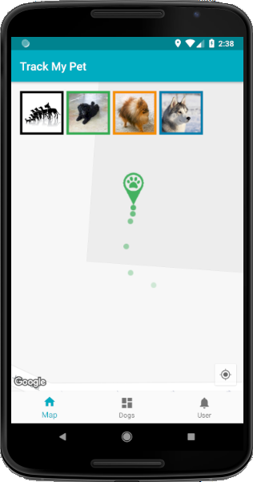
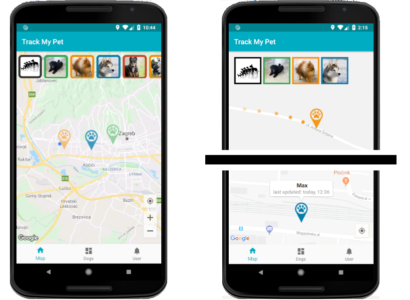
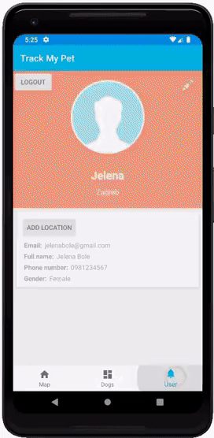
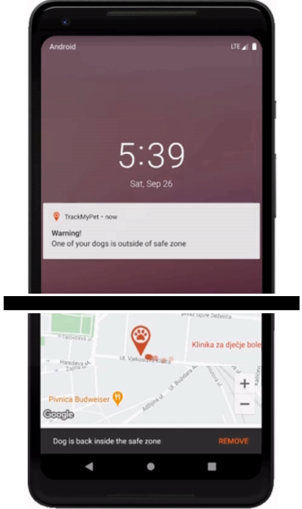
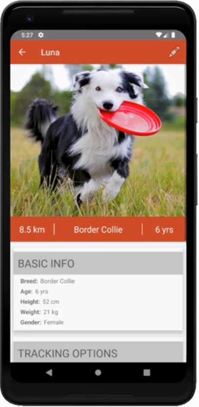
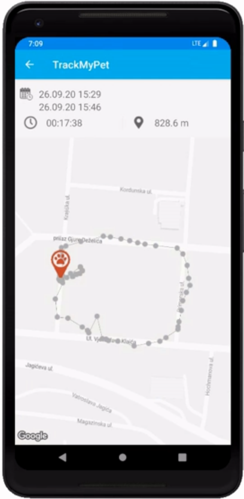

<h1 align="center"> :feet: Dog Tracker :feet: </h1>

This is an Android application that can be used to track dogs with any type of Android device. It can keep track of multiple devices simultaneously, and calculate their traveled distance and duration. Minimum required SDK for user application is 7.1, while the location service needs at least 4.0.

🚧🚧

This application was built as a part of a bachelor's thesis. :mortar_board: The system consist of this mobile application, service on a chip for sending dog's location information, and a Firebase BaaS (realtime database and cloud functions).

## Usage
To use this application, simply install the APK file onto your device and launch the application. To use it, Google Play Services is required. After launching the application, you need to log in, and add at least one dog. Dogs can be added by installing a trackerService on any Android device, after which you will receive a key for connecting with it. After adding new dog, all features can be tested - features are explained below under "App Features". Apart from maps and dog list view, there is a (currently non-functioning) settings menu, which holds basic user info and safe zones, without any other settings options. The pre-built APKs are in this repository in /libs directory.

## Setting up your environment
In order to develop dogTracker further, you need to install:
🚧 👷‍♀️ 🚧
<!--
1. Android studio or similar
2. Use SDK with Google Play Services (Tools -> Android -> SDK Manager)
3. Android version needs to support Google Play Services
4. Google API key is included in Android Manifest, but Firebase information isn't
5. You need to create Firebase DB in the FB console, and add config info in the app (firebase.json)

run build gradle and run app

In order to develop and build myTrack, you must install Android studio[1] 0.4.0 or higher (last built against 0.4.6, recommended version). Once the SDK is installed, you must use the SDK manager (Main Menu Bar > Tools > Android > SDK Manager) to install the "Google Repository" and "Google Play Services" [2], [3]. Many of these steps have already been performed though (such as modifying AndroidManifest.xml to include the API key) so you should only need to install these files from the SDK manager.

In addition, this application will not run correctly (maps will not work, application may force close) unless the proper signing key is used in the build process (as only .apk files generated and signed by approved keys will work with the Google Maps Android API). If you do not have an existing Android environment whose keys you care about, the easiest way to do this is to copy the debug.keystore file to the proper location on your environment [4].
-->

## App Features

* 🗺️📍 **Map** shows user and dogs' positions
  * by default, map zooms out so that all known dog locations are visible
  * opacity of dogs' markers depends on the time elapsed since the last location update
  * clicking on the dog marker displays the info bubble (image 2)
  * clicking on dog's thumbnail starts dog tracking - zooms in, shows tracks, screen follows the dog until the tracking is interrupted (image 3)

  

* 🏡❗ **Safe zone and Notifications**
  * users can enter multiple addresses (with assigned range) that can be assigned to a dog as a movement restriction (image 1)
  * if dog gets out of this area, the user will receive a notification (in system tray or in-app, as shown in image 2)

  
  

* :dog: **Dog details**
  * displays user-entered dogs' details that can be editet here (image 1)
  * shows tracking settings which include the Safe Zone as a parameter that triggers push notifications and frequency at which service will send location updates (pings can be less frequent to avoid draining battery)
  * displays dogs' activity history where user can see his movements, see all tracks on the path, and its distance and duration (image 3)

  
  
  

## See Also
For more information on various elements used in this application with the code examples, follow these links:

* [Android components, animations and permissions](https://developer.android.com/guide)
* [Fresco - image management lib](https://frescolib.org/docs/)
* [Butterknife for view binding](https://jakewharton.github.io/butterknife/)
* [Dynamic lists with RecyclerView](https://developer.android.com/guide/topics/ui/layout/recyclerview?gclid=Cj0KCQjw1PSDBhDbARIsAPeTqrfDqC5X-ScZiVeVBKKswXmszpIGaWRnxqOK-lfjoztK0KEaiF9lskUaArpxEALw_wcB&gclsrc=aw.ds)
* [Firebase Backend-as-a-Service](https://www.altexsoft.com/blog/firebase-review-pros-cons-alternatives/)
* [Firebase Realtime DB - read and write](https://firebase.google.com/docs/database/android/read-and-write)
* [Firebase Realtime DB many-to-many relationship schema](https://medium.com/@alfianlosari/firebase-realtime-database-many-to-many-relationship-schema-4155d9647f0f)
* [Using OAuth 2.0 to Access Google APIs](https://developers.google.com/identity/protocols/oauth2)
* [Cloud Messaging client for push notifications](https://firebase.google.com/docs/cloud-messaging)
* [Usage of Cloud Functions as DB triggers](https://firebase.google.com/docs/functions/use-cases)
* [Snackbar for showing in-app notifications](https://developer.android.com/training/snackbar/action)
* [Google Play Location Service API](https://developer.android.com/training/location)
* [Creating Google Map, configuration and styles](https://developers.google.com/maps/documentation/android-sdk/map)
* [Drawing on a map - markers, info windows and polylines](https://developers.google.com/maps/documentation/android-sdk/marker)
* [Map Fragment and OnMapReady callback](https://developers.google.com/android/reference/com/google/android/gms/maps/MapFragment)
* [Map's Camera update and Change Listeners](https://developers.google.com/android/reference/com/google/android/gms/maps/package-summary)
* [Orange PI - User Manual](https://drive.google.com/drive/folders/10JgzyjuYb45SGw8T3rh6QPPxQ2TGRCJp)

